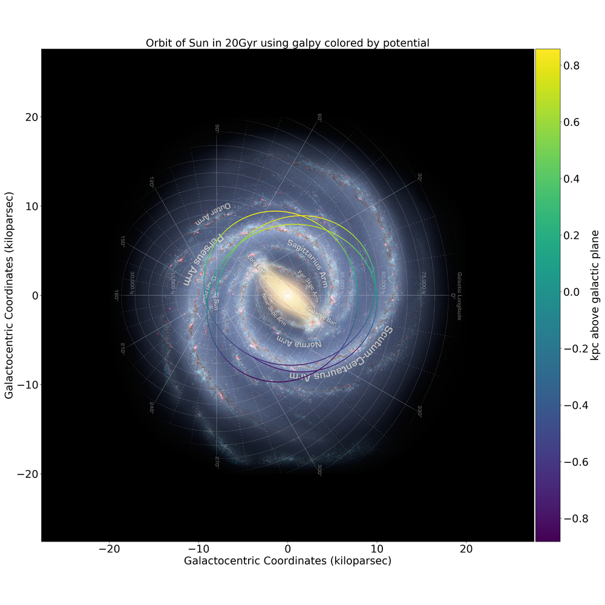
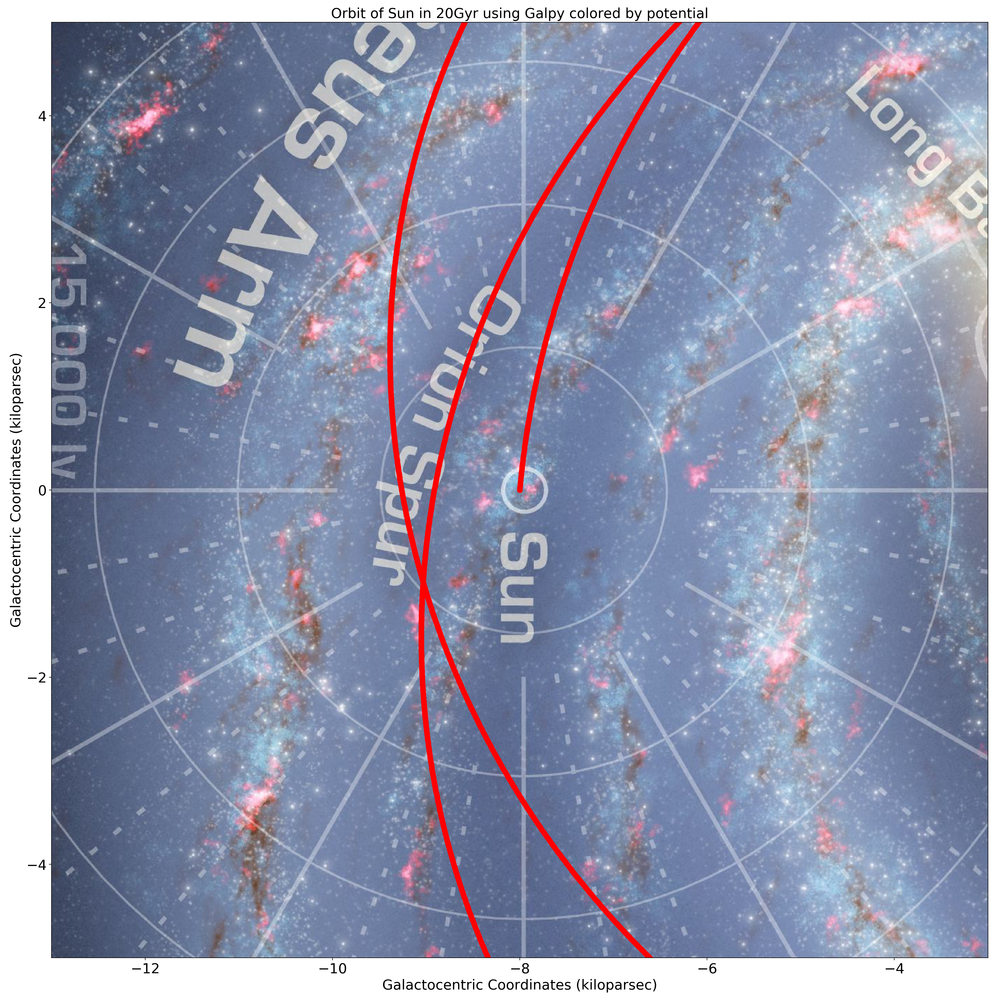

## mw_plot

A handy python script to plot things on a face-on milkyway using pylab

The Milky-Way background Credits: NASA/JPL-Caltech/R. Hurt (SSC/Caltech)
Both MW.png and MW_galactocentric.png are 7500x7500px with resolution of 24.2 lightyears per pixel

## Usage

```
from mw_plot import MWPlot

# setup a MWPlot instance
plot_instance = MWPlot()

# Here are some setting you can set
plot_instance.unit = units.kpc
plot_instance.coord = 'galactocentric'  # can be 'galactocentric' or 'galactic'
plot_instance.center = (0, 0) * units.kpc
plot_instance.radius = 90750 * u.lyr
plot_instance.figsize = (20, 20)
plot_instance.dpi = 200
plot_instance.cmap = 'viridis'  # matplotlib cmap: https://matplotlib.org/examples/color/colormaps_reference.html
plot_instance.s = 50.0  # make the scatter points bigger

# Here is the mw_plot if you have an array to color the point
# x and y must both carry astropy unit
plot_instance.mw_plot(x, y, [z, 'title of color bar'], 'Title of the plot here')

# Here is the mw_plot if you do array to color the point
# x and y must both carry astropy unit

# To plot
plot_instance.plot()

# To save
plot_instance.savefig('name.png')
```

## Example usage by plotting orbits of Sun integrated by galpy



```
from galpy.potential import LogarithmicHaloPotential
from galpy.orbit import Orbit
import numpy as np
from astropy import units
from mw_plot import MWPlot
import pylab as plt

# Orbit Integration using galpy for the Sun
op= Orbit(vxvv=[-8.*units.kpc,22.*units.km/units.s,242*units.km/units.s,0.*units.kpc,22.*units.km/units.s,0.*units.deg])
lp= LogarithmicHaloPotential(normalize=1.)
ts= np.linspace(0,20,10000)
op.integrate(ts,lp)
x = (op.x(ts))*units.kpc
y = op.y(ts)*units.kpc
z = op.z(ts)

# setup a MWPlot instance
plot_instance = MWPlot()
plot_instance.unit = units.kpc
plot_instance.coord = 'galactocentric'

# plot
plot_instance.mw_plot(x, y, [z, 'kpc above galactic plane'], 'Orbit of Sun in 20Gyr using Galpy colored by potential')
# Save the figure
plot_instance.savefig(file='mw_plot.png')
# Show the figure
plot_instance.show()
```



```
from galpy.potential import LogarithmicHaloPotential
from galpy.orbit import Orbit
import numpy as np
from astropy import units
from mw_plot import MWPlot
import pylab as plt

# Orbit Integration using galpy for the Sun
op= Orbit(vxvv=[-8.*units.kpc,22.*units.km/units.s,242*units.km/units.s,0.*units.kpc,22.*units.km/units.s,0.*units.deg])
lp= LogarithmicHaloPotential(normalize=1.)
ts= np.linspace(0,20,10000)
op.integrate(ts,lp)
x = (op.x(ts))*units.kpc
y = op.y(ts)*units.kpc
z = op.z(ts)

# setup a MWPlot instance
plot_instance = MWPlot()
plot_instance.unit = units.kpc
plot_instance.coord = 'galactocentric'

# Set the center and radius of the plot
plot_instance.center = (0, -8) * units.kpc
plot_instance.radius = 5 * units.kpc

plot_instance.s = 50.0  # make the scatter points bigger

# plot
plot_instance.mw_plot(x, y, 'r', 'Orbit of Sun in 20Gyr using Galpy colored by potential')

# Save the figure
plot_instance.savefig(file='mw_plot_zoomed.png')
# Show the figure
plot_instance.show()
```

## Author

* **Henry Leung** - *Initial work and developer* - [henrysky](https://github.com/henrysky)\
*Astronomy Undergrad, University of Toronto*\
*Contact Henry: henrysky.leung [at] mail.utoronto.ca*

## License
This project is licensed under the MIT License - see the [LICENSE](LICENSE) file for details