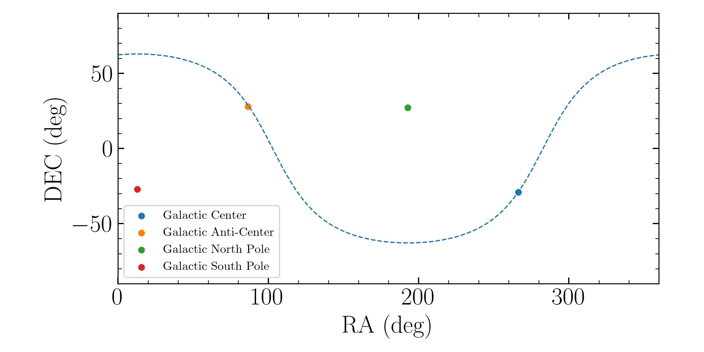

Basic Usage
=================

This python package consists of two major abstract classes - ``MWPlotBase`` and ``MWSkyMapBase`` with 
Matplotlib or Bokeh backend as well as  a few useful utilities. 

``MWPlotBase`` is used to plot things on a face-on milkyway with galactic and galactocentric coordinates. 
``MWSkyMapBase`` is used to plot skymap with milkyway background with RA/DEC.

Matpotlib Style Sheet
-----------------------

The package comes with a matplotlib style sheet that you can use to make your plots look better and consistent which
required :math:`\LaTeX` to be installed (see https://www.latex-project.org/get/ for how to install :math:`\LaTeX` on your computer). 
To use the style sheet for you own plot without importing ``mw-plot``, you can do the following before plotting anything:

.. code-block:: python

    >>> import matplotlib.pyplot as plt
    >>> plt.style.use("mw_plot.mplstyle")  # require LaTeX installed in your system

..
    >>> plt.style.use("default")  # to revert back to default style to avoid installing latex dependency in CI tests

Now you can plot anything and matplotlib will use the style sheet.

Useful Constants
-------------------

.. code-block:: python

    >>> from mw_plot import center_radec, anti_center_radec, northpole_radec, southpole_radec  # constants
    >>> from mw_plot import mw_radec # milkyway plane in RA/DEC

    >>> center_radec  # refers to the [RA, DEC] of galactic center in deg
    [266.4167, -29.0078]
    >>> anti_center_radec  # refers to the [RA, DEC] of galactic anti-center in deg
    [86.4167, 28.0078]
    >>> northpole_radec  # refers to the [RA, DEC] of galactic north pole in deg
    [192.7667, 27.1167]
    >>> southpole_radec  # refers to the [RA, DEC] of galactic south pole in deg
    [12.7667, -27.1167]

    >>> mw_plane_ra, mw_plane_dec = mw_radec(deg=True)  # RA/DEC arrays of milkyway plane

