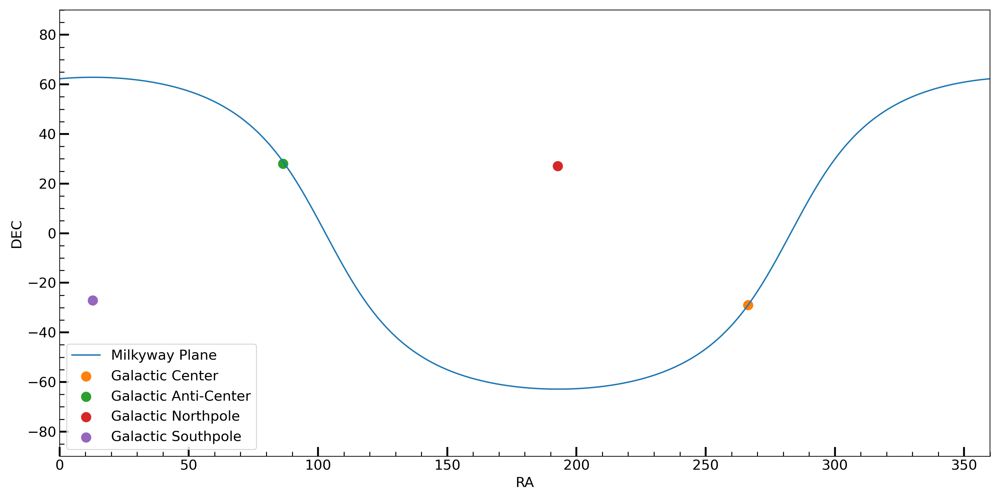

Basic Usage
=================

This python package consists of two major abstract classes - MWPlotMaster and MWSkyMapMaster with Matplotlib or Bokeh backend as well as  a few useful utilities. 

MWPlotMaster is used to plot things on a face-on/edge-on milkyway with galactic/galactocentric coordinates. MWSkyMapMaster is used to plot skymap with milkyway background with RA/DEC.

Useful constants
-------------------

.. code-block:: python
    :caption: A few usage constants
    :linenos:

    from mw_plot import center_radec, anti_center_radec, northpole_radec, southpole_radec  # constants
    from mw_plot import mw_radec # milkyway plane in RA/DEC

    center_radec  # refers to the [RA, DEC] of galactic center in deg
    anti_center_radec  # refers to the [RA, DEC] of galactic anti-center in deg
    northpole_radec  # refers to the [RA, DEC] of galactic north pole in deg
    southpole_radec  # refers to the [RA, DEC] of galactic south pole in deg

    mw_plane_ra, mw_plane_dec = mw_radec(deg=True)  # RA/DEC arrays of milkyway plane

