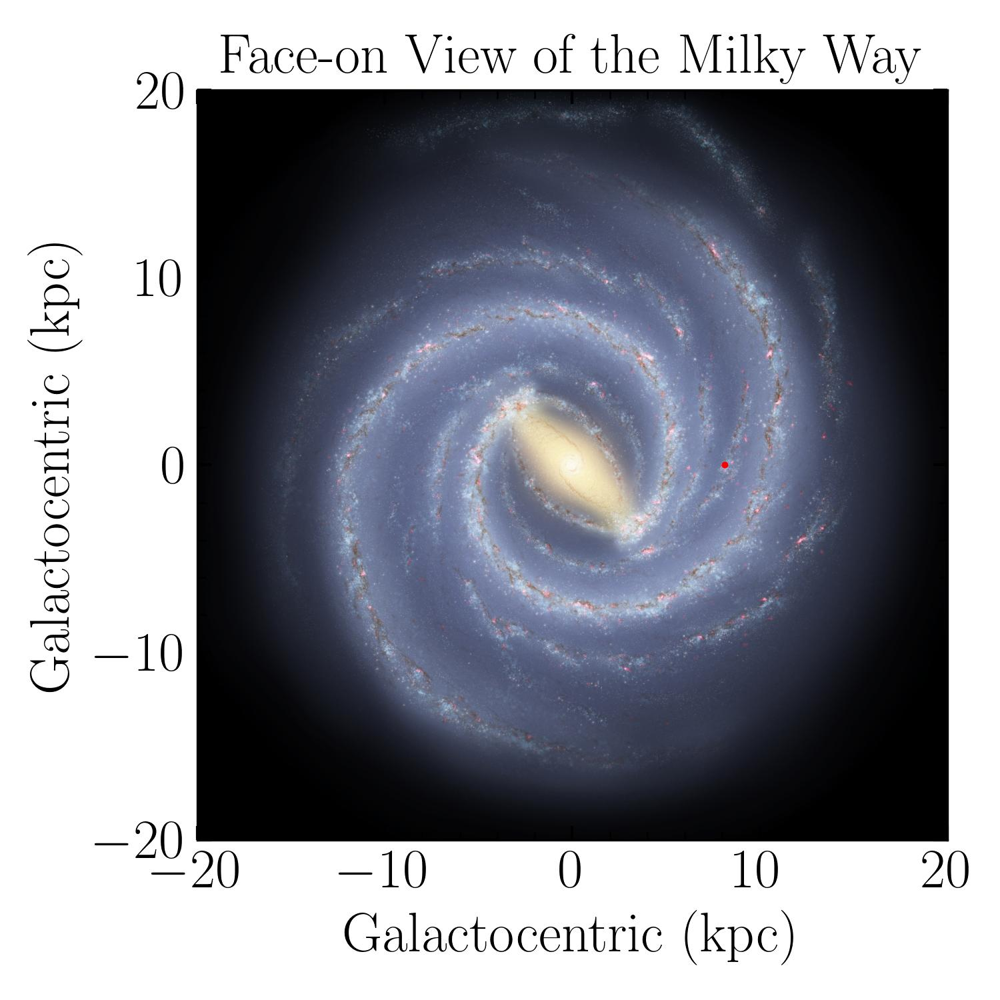
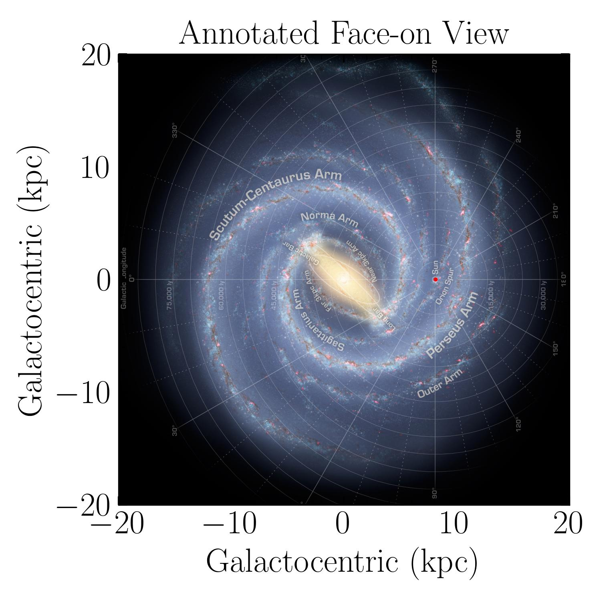
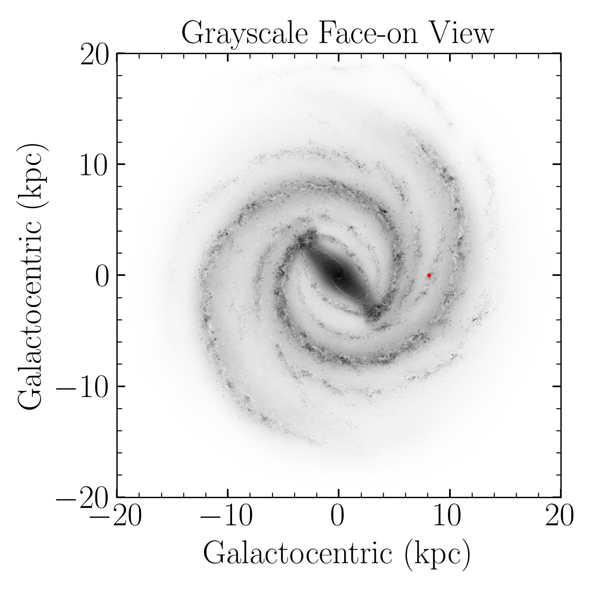

.. automodule:: mw_plot.mw_plot_matplotlib

Face-On View of Milky Way
==============================

Introduction
------------------

``MWFaceOn`` class is a wrapper around the ``matplotlib`` library to plot the face-on view of 
the Milky Way. It provides a simple interface to plot the face-on view of the Milky Way.

MilkyWay Bird's Eye
---------------------

.. code-block:: python

    >>> import numpy as np
    >>> from astropy import units as u
    >>> from mw_plot import MWFaceOn

    >>> mw1 = MWFaceOn(
    ...     radius=20 * u.kpc,
    ...     unit=u.kpc,
    ...     coord="galactocentric",
    ...     annotation=True,
    ...     figsize=(10, 8),
    ... )
    >>> mw1.title = "Bird's Eyes View"
    >>> mw1.scatter(8 * u.kpc, 0 * u.kpc, c="r", s=2)

Annotation and Grayscale
^^^^^^^^^^^^^^^^^^^^^^^^^^

If you set annotation to True, the annotation of the Milky Way components will be shown.

If you set grayscale to True, the image will be shown in grayscale.

Coordinates and units
^^^^^^^^^^^^^^^^^^^^^^

Class API
---------------

.. autoclass:: mw_plot.MWFaceOn
    :members:
