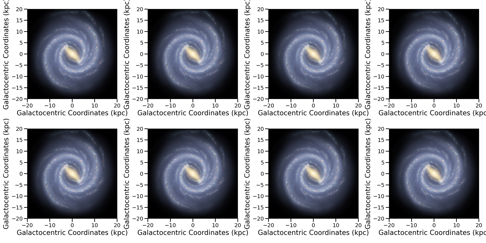

Multiple Subplots
=====================

In the case of having multiple subplots, you can initialize one of the mw-plot class instances to utilize ``transform()`` method to 
transform one or more subplots.

Tranform a single subplot
---------------------------

.. code-block:: python
    :linenos:

    import pylab as plt
    from mw_plot import MWPlot
    from astropy import units as  u

    # setup a mw-plot instance of bird's eyes view of the disc
    mw1 = MWPlot(radius=20 * u.kpc, center=(0, 0)*u.kpc, unit=u.kpc, coord='galactocentric', rot90=2, grayscale=False, annotation=False)

    # setup subplots with matplotlib
    fig, (ax1, ax2) = plt.subplots(1, 2, figsize=(15, 7.5))

    # transform the second subplot with mw-plot
    mw1.transform(ax2)

    # you can plot something on top of the transformed subplot
    ax2.scatter(8, 0, c='r', s=100)

    # plot something in the first subplot
    ax1.plot([0, 1], [0, 1])
    ax1.plot([0, 1], [1, 0])

Tranform multiple subplots
--------------------------------

.. code-block:: python
    :linenos:

    import pylab as plt
    from mw_plot import MWPlot
    from astropy import units as  u

    # setup a mw-plot instance of bird's eyes view of the disc
    mw1 = MWPlot(radius=20 * u.kpc, center=(0, 0)*u.kpc, unit=u.kpc, coord='galactocentric', rot90=2, grayscale=False, annotation=False)

    # setup subplots with matplotlib
    fig, (ax1, ax2) = plt.subplots(1, 2, figsize=(15, 7.5))

    # transform the whole figure with mw-plot
    # mw1.transform(fig) will have the same effect
    mw1.transform([ax1, ax2])

    # you can plot something on top of the transformed subplot
    ax2.scatter(8, 0, c='r', s=100)

    # plot something in the first subplot
    ax1.plot([20, -20], [20, -20])
    ax1.plot([20, -20], [-20, 20])

Tranform subplots with different style
---------------------------------------

Not only you can transform with one style, you can do multiple style too

.. code-block:: python
    :linenos:

    import pylab as plt
    from mw_plot import MWPlot, MWSkyMap
    from astropy import units as  u

    # setup a mw-plot instance of bird's eyes view of the disc
    mw1 = MWPlot(radius=20 * u.kpc, center=(0, 0)*u.kpc, unit=u.kpc, coord='galactocentric', rot90=2, grayscale=False, annotation=False)
    mw2 = MWPlot(radius=20 * u.kpc, center=(0, 0)*u.kpc, unit=u.kpc, coord='galactocentric', rot90=2, grayscale=True, annotation=False)
    mw3 = MWSkyMap()

    # setup subplots with matplotlib
    fig = plt.figure(figsize=(15, 15))
    ax1 = fig.add_subplot(221)
    ax2 = fig.add_subplot(222)
    ax3 = fig.add_subplot(212)

    # transform the subplots with different style
    mw1.transform(ax1)
    mw2.transform(ax2)
    mw3.transform(ax3)

    fig.tight_layout()

Tranform all subplots 
-----------------------

You can quickly transform all subplots in a figure

.. code-block:: python
    :linenos:

    import pylab as plt
    from mw_plot import MWPlot
    from astropy import units as  u

    # setup a mw-plot instance of bird's eyes view of the disc
    mw1 = MWPlot(radius=20 * u.kpc, center=(0, 0)*u.kpc, unit=u.kpc, coord='galactocentric', grayscale=False, annotation=False)

    # setup subplots with matplotlib
    fig, (ax_top, ax_bottom) = plt.subplots(2, 4, figsize=(20, 10))

    # transform the whole figure with mw-plot
    # mw1.transform([ax1, ax2]) will have the same effect
    mw1.transform(fig)

