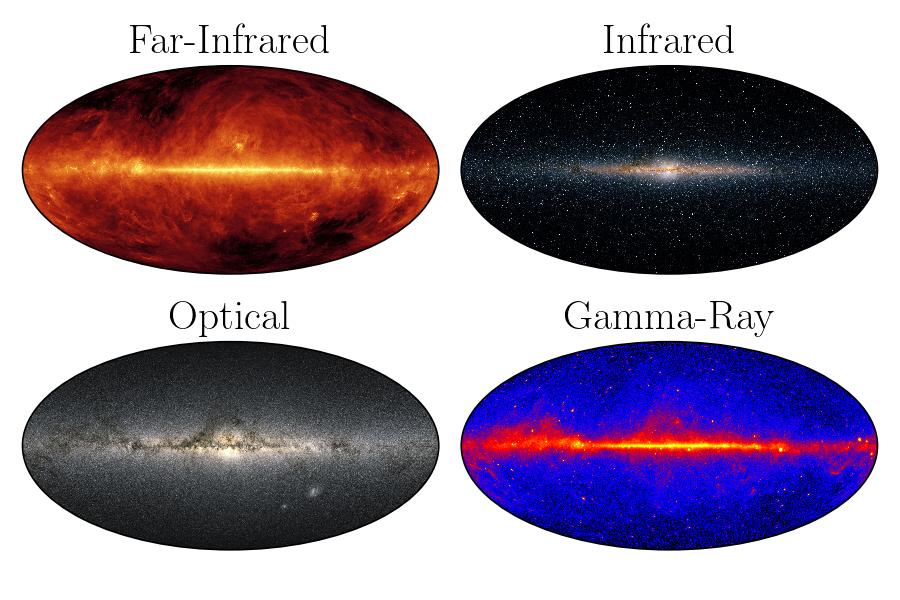

Multiple Subplots
=====================

In the case of having multiple subplots, you can initialize one of the mw-plot class instances and utilize ``transform()`` method to 
transform one or more subplots.

Tranforming a Single Subplot
---------------------------------

In a multiple subplot scenario, you can transform a single subplot with ``mw-plot``. For example

.. code-block:: python

    >>> import matplotlib.pyplot as plt
    >>> from mw_plot import MWFaceOn

    >>> mw1 = MWFaceOn()
    >>> fig, (ax1, ax2) = plt.subplots(1, 2, figsize=(10, 5))
    >>> # transform the first subplot
    >>> mw1.transform(ax2)

    >>> # plot something in the first subplot
    >>> ax1.plot([0, 1], [0, 1])  # doctest:+ELLIPSIS
    [<matplotlib.lines.Line2D object at ...>]
    >>> ax1.plot([0, 1], [1, 0])  # doctest:+ELLIPSIS
    [<matplotlib.lines.Line2D object at ...>]
    >>> ax1.set_aspect("equal")

    >>> # you can plot something on top of the transformed subplot
    >>> ax2.plot([-10, 10], [10, -10], c="r", ls="--")  # doctest:+ELLIPSIS
    [<matplotlib.lines.Line2D object at ...>]

..
    >>> import matplotlib.pyplot as plt
    >>> plt.close("all")

Tranform Multiple Subplots
--------------------------------

To transform multiple subplots at once, you can pass a list of axes to the ``transform()`` method. For example

.. code-block:: python

    >>> import matplotlib.pyplot as plt
    >>> from mw_plot import MWFaceOn

    >>> mw1 = MWFaceOn()
    >>> fig, (ax1, ax2) = plt.subplots(1, 2, figsize=(10, 5))
    >>> # transform multiple axes with mw-plot at once
    >>> mw1.transform([ax1, ax2])
    >>> # plot something in both plots
    >>> ax1.plot([10, -10], [10, -10], c="r", ls="--")  # doctest:+ELLIPSIS
    [<matplotlib.lines.Line2D object at ...>]
    >>> ax2.plot([10, -10], [-10, 10], c="r", ls="--")  # doctest:+ELLIPSIS
    [<matplotlib.lines.Line2D object at ...>]

..
    >>> import matplotlib.pyplot as plt
    >>> plt.close("all")

Tranform subplots with projection
---------------------------------------

If you are plotting sky maps with projection, your subplot should be in that particular projection already before transforming. For example,

.. code-block:: python

    >>> import matplotlib.pyplot as plt
    >>> from mw_plot import MWSkyMap

    >>> fig = plt.figure(figsize=(6, 4))
    >>> ax1 = fig.add_subplot(221, projection="mollweide")
    >>> ax2 = fig.add_subplot(222, projection="mollweide")
    >>> ax3 = fig.add_subplot(223, projection="mollweide")
    >>> ax4 = fig.add_subplot(224, projection="mollweide")

    >>> mw1 = MWSkyMap(projection="mollweide", background="far-infrared")
    >>> mw1.transform(ax1)
    >>> mw2 = MWSkyMap(projection="mollweide", background="infrared")
    >>> mw2.transform(ax2)
    >>> mw3 = MWSkyMap(projection="mollweide", background="optical")
    >>> mw3.transform(ax3)
    >>> mw4 = MWSkyMap(projection="mollweide", background="gamma")
    >>> mw4.transform(ax4)

    >>> ax1.set_title("Far-Infrared")  # doctest:+ELLIPSIS
    Text(...)
    >>> ax2.set_title("Infrared")  # doctest:+ELLIPSIS
    Text(...)
    >>> ax3.set_title("Optical")  # doctest:+ELLIPSIS
    Text(...)
    >>> ax4.set_title("Gamma-Ray")  # doctest:+ELLIPSIS
    Text(...)

..
    >>> import matplotlib.pyplot as plt
    >>> plt.close("all")

