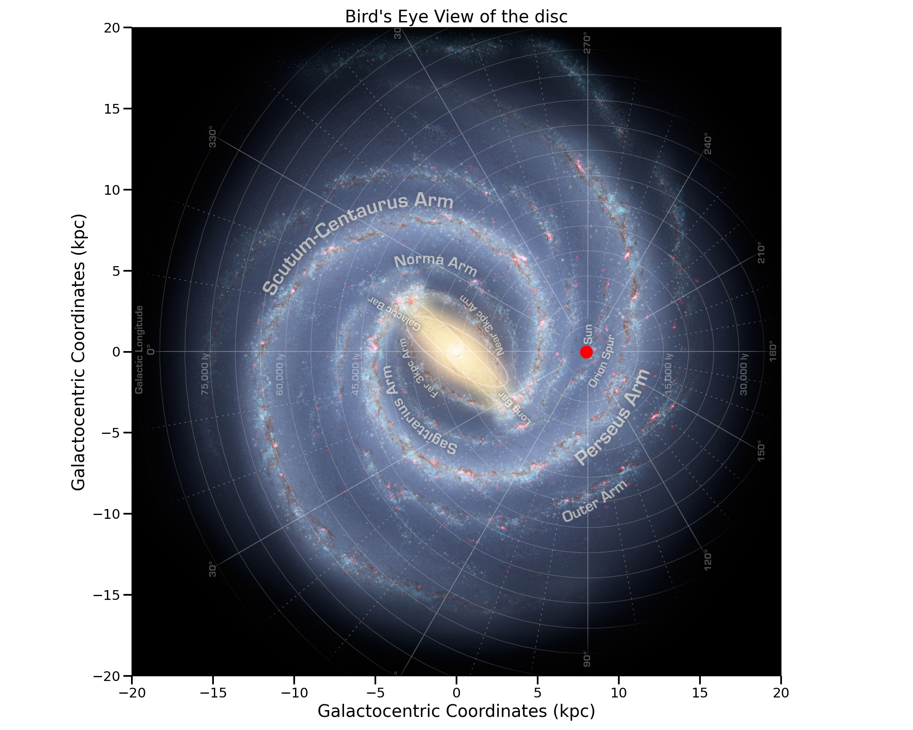
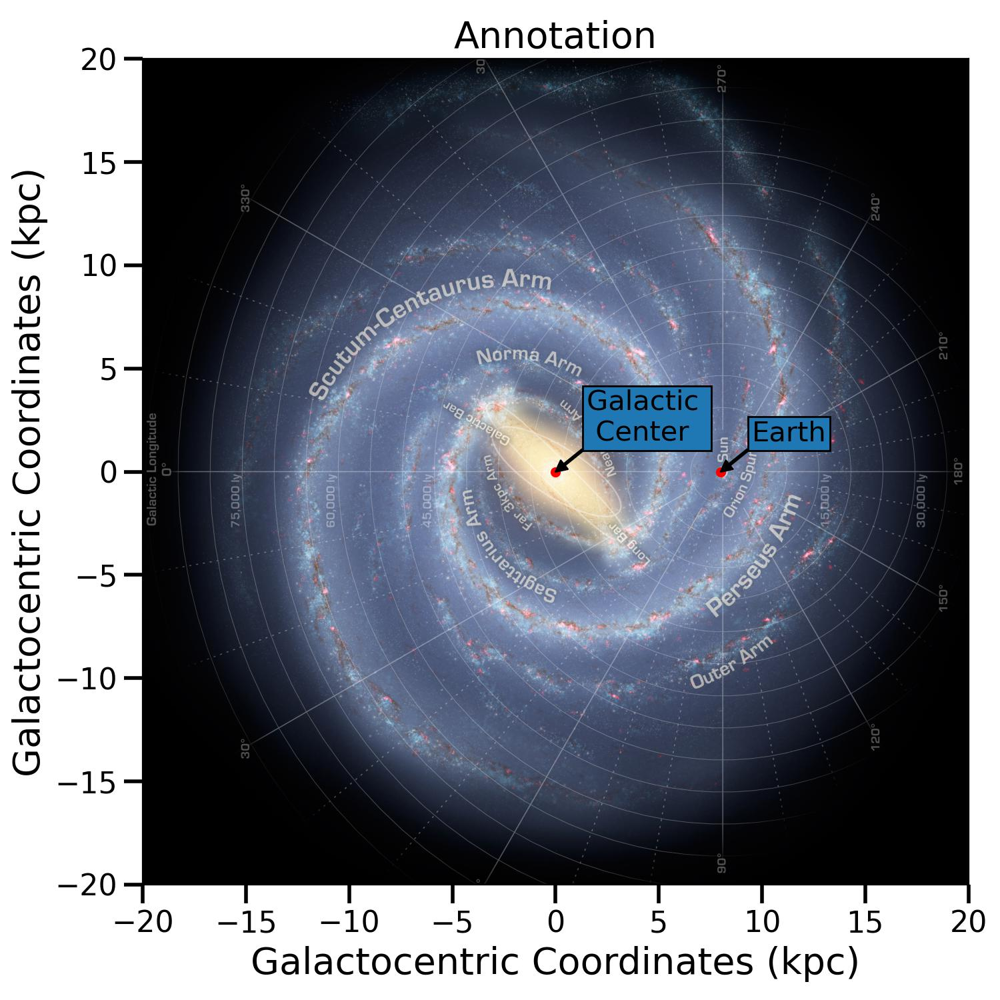
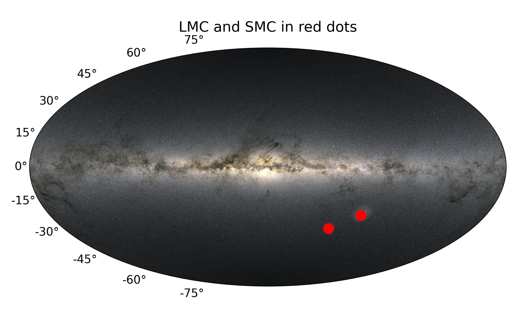
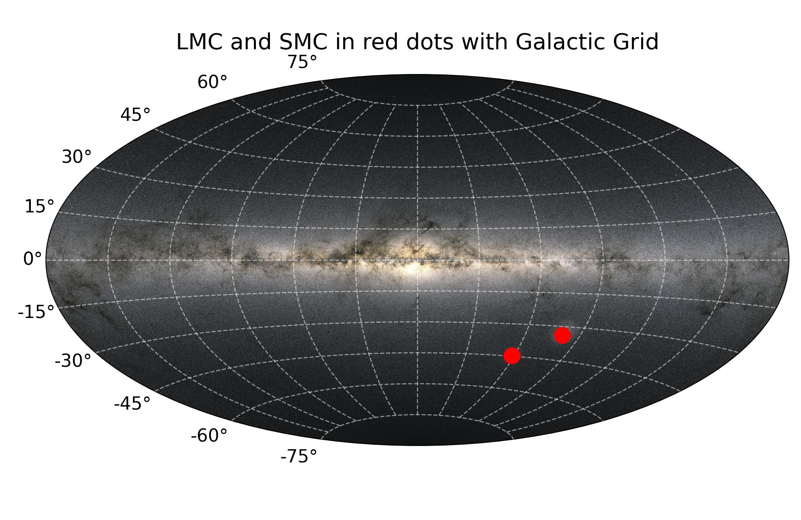

.. automodule:: mw_plot.mw_plot_matplotlib

Single Plot
=============

Classes API
---------------

.. autoclass:: mw_plot.MWPlot
    :members:

.. autoclass:: mw_plot.MWSkyMap
    :members:

MilkyWay Bird's Eye
---------------------

.. code-block:: python
    :linenos:

    import numpy as np
    from astropy import units as u
    from mw_plot import MWPlot

    # setup a mw-plot instance of bird's eye view of the disc
    mw1 = MWPlot(
        radius=20 * u.kpc,
        unit=u.kpc,
        coord="galactocentric",
        annotation=True,
        figsize=(15, 12),
    )

    # set up plot title
    mw1.title = "Bird's Eyes View"

    mw1.scatter(8 * u.kpc, 0 * u.kpc, c="r", s=200)

Annotation
^^^^^^^^^^^

.. code-block:: python
    :linenos:

    import numpy as np
    from astropy import units as u
    from mw_plot import MWPlot

    mw1 = MWPlot(radius=20 * u.kpc, unit=u.kpc, coord="galactocentric", annotation=True)

    # set up plot title
    mw1.title = "Annotation"

    mw1.scatter_annotate(["Earth", "Galactic \n Center"], [[8.0, 0.0], [0.0, 0.0]] * u.kpc)

MilkyWay Sky Map
------------------

.. code-block:: python
    :linenos:

    import numpy as np
    from astropy import units as u
    from mw_plot import MWSkyMap

    # setup a MWSkyMap instance with projection, other projection can be 'hammer', 'mollweide' etc
    # grayscale: whether to turn the background image to grayscale
    mw1 = MWSkyMap(projection="aitoff", grayscale=False)

    # set up plot title
    mw1.title = "LMC and SMC in red dots"

    # LMC and SMC coordinates
    lsmc_ra = [78.77, 16.26] * u.degree
    lsmc_dec = [-69.01, -72.42] * u.degree

    mw1.scatter(lsmc_ra, lsmc_dec, c="r", s=200)

You can also plot with grid
^^^^^^^^^^^^^^^^^^^^^^^^^^^^^^

.. code-block:: python
    :linenos:

    import numpy as np
    from astropy import units as u
    from mw_plot import MWSkyMap

    # setup a MWSkyMap instance with projection, other projection can be 'hammer', 'mollweide' etc
    # grid: whether to show the grid
    mw1 = MWSkyMap(projection="aitoff", grid=True)

    # set up plot title
    mw1.title = "LMC and SMC in red dots"

    # LMC and SMC coordinates
    lsmc_ra = [78.77, 16.26] * u.degree
    lsmc_dec = [-69.01, -72.42] * u.degree

    mw1.scatter(lsmc_ra, lsmc_dec, c="r", s=200)

