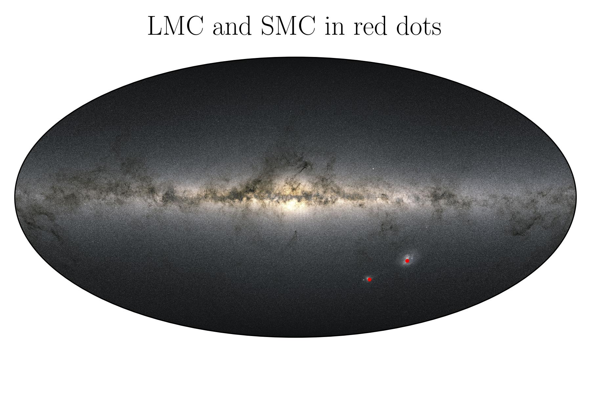
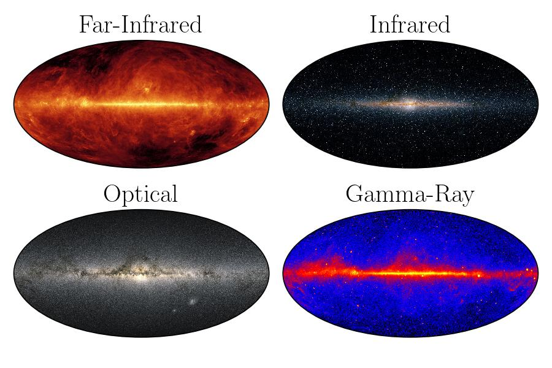
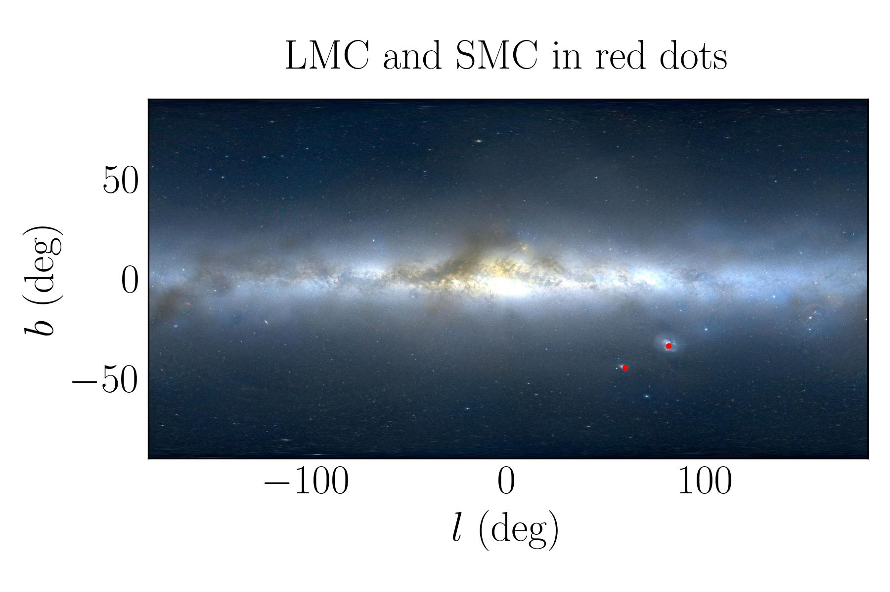
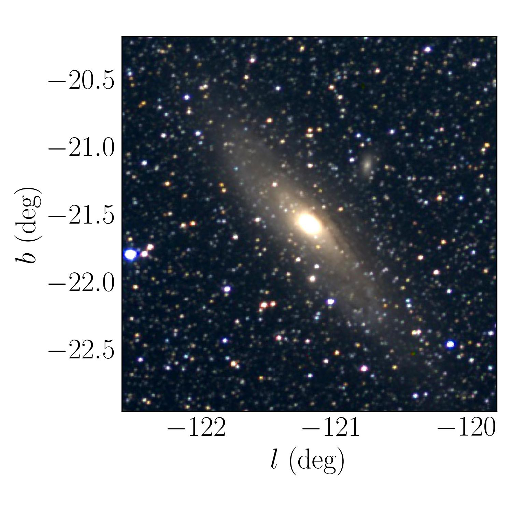
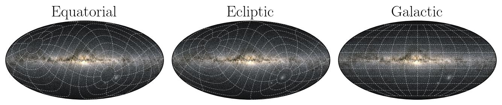
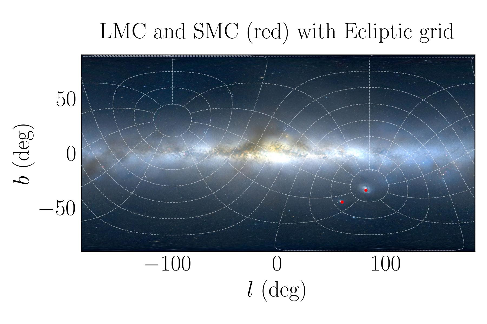

.. automodule:: mw_plot.mw_plot_matplotlib

Sky Map of Milky Way
==============================

Introduction
------------------

``MWSkyMap`` class is a wrapper around the ``matplotlib`` library to plot the sky map of the Milky Way. 
It provides a simple interface to plot the sky map with different projections, background images, and grid lines. 
The class is designed to be simple and easy to use.

.. code-block:: python
    :linenos:

    >>> from astropy import units as u
    >>> from mw_plot import MWSkyMap

    >>> mw1 = MWSkyMap(projection="aitoff", grayscale=False)
    >>> mw1.title = "LMC and SMC in red dots"
    >>> mw1.scatter([78.77, 16.26] * u.degree, [-69.01, -72.42] * u.degree, c="r", s=200)

Bbackground Images
------------------

``mw_plot`` use Gaia DR3 as the default background image. But a few background images are included within the package which represent 
``optical``, ``gamma``, ``far-infrared`` and ``infrared`` such that they can be used even without an internet connection to fetch images. 

For other background images from Hierarchical Progressive Surveys (HiPS), you can use the ``search_sky_background`` method to search for available HiPS images. 
HiPS of the code has made use of the hips2fits, a tool developed at CDS, Strasbourg, France aiming at extracting FITS images from HiPS sky maps with respect to a WCS.

You can search for list of available HiPS images with keywords by using the following code

You can search for HiPS images with specific keywords. For example

.. code-block:: python
    :linenos:

    >>> from mw_plot import MWSkyMap
    >>> MWSkyMap.search_sky_background(keywords="extragalactic optical color")
    ['Mellinger color optical survey']

will return a list of all available HiPS images came from Gaia DR3. If no keyword is given (i.e. None), the function will return a list of all available HiPS images.

You then can use the ``background`` parameter to set the background image from the search result. For example

.. code-block:: python
    :linenos:

    >>> from astropy import units as u
    >>> from mw_plot import MWSkyMap

    >>> mw1 = MWSkyMap(background="Mellinger color optical survey")
    >>> mw1.title = "LMC and SMC in red dots"
    >>> mw1.scatter([78.77, 16.26] * u.degree, [-69.01, -72.42] * u.degree, c="r", s=3)

You can also zoom in to a specific region of the sky by setting the ``center`` and ``radius`` 
parameters. For example to zoom in to the M31 galaxy, you can use the following code

.. code-block:: python
    :linenos:

    >>> import matplotlib.pyplot as plt
    >>> from astropy import units as u
    >>> from mw_plot import MWSkyMap
    >>> mw1 = MWSkyMap(
    ...     center="M31",
    ...     radius=(4000, 4000) * u.arcsec,
    ...     background="Mellinger color optical survey",
    ... )
    >>> fig, ax = plt.subplots(figsize=(5, 5))
    >>> mw1.transform(ax)

Celestial Grids
---------------------------

You can plot the sky map with grid lines. The grid lines can be in Galactic, Equatorial, or Ecliptic coordinates.

.. code-block:: python
    :linenos:

    >>> from astropy import units as u
    >>> from mw_plot import MWSkyMap

    >>> mw1 = MWSkyMap(background="Mellinger color optical survey", grid="ecliptic")
    >>> mw1.title = "LMC and SMC (red) with Ecliptic grid"
    >>> mw1.scatter([78.77, 16.26] * u.degree, [-69.01, -72.42] * u.degree, c="r", s=3)

Class API
---------------

.. autoclass:: mw_plot.MWSkyMap
    :members:
